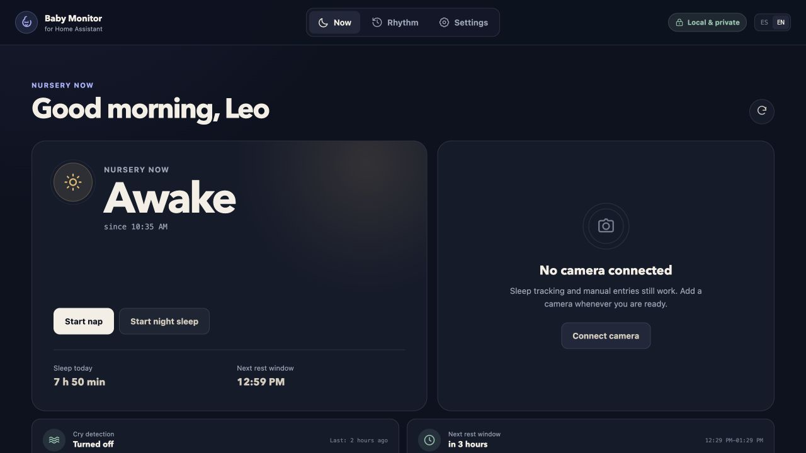
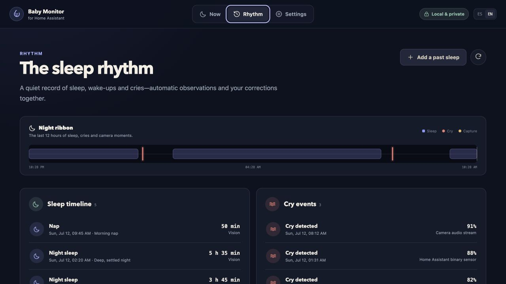
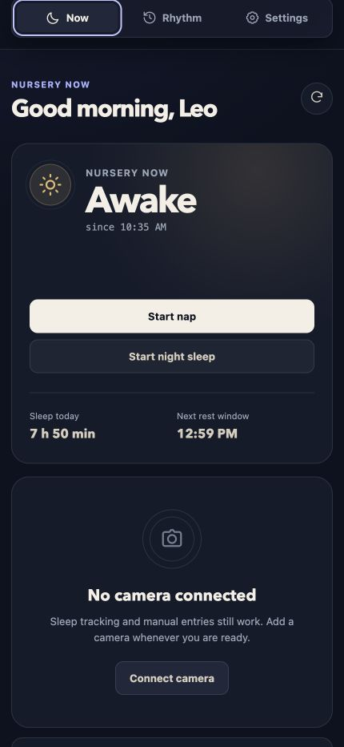

# Baby Monitor for Home Assistant

An open-source, local-first baby monitor that runs next to Home Assistant. It
combines sleep tracking, optional camera snapshots, cry-triggered light alerts,
notifications, and optional AI image labels in one admin-only web interface.

[](https://my.home-assistant.io/redirect/supervisor_add_addon_repository/?repository_url=https%3A%2F%2Fgithub.com%2Fvictoriano%2Fhome-assistant-baby-monitor)

> [!IMPORTANT]
> This project is not a medical device and is not a replacement for direct
> adult supervision or a certified baby monitor. Cry and image detection can
> miss events or produce false alarms.

## Preview



<table>
  <tr>
    <td width="68%">
      
    </td>
    <td width="32%">
      
    </td>
  </tr>
</table>

Screenshots use synthetic demo data. No real child, camera, or Home Assistant
credentials are included.

## What it does

- Lets each household select its own Home Assistant camera or private RTSP URL.
- Tracks and edits naps, night sleep, awakenings, awake pauses, settling
  context, wake-up context, mood, comments, and nearby camera frames.
- Builds a local two-day plan with predicted naps and night sleep for today and
  tomorrow; no AI key is required for sleep prediction.
- Restores the original rich rhythm view with calendar navigation, circular
  sleep segments aligned to the actual wake/bed boundaries, a light Day theme,
  a dark Night theme, and separate day/night summaries.
- Keeps the original five-action caregiver navigation: Home, Trends, Add,
  Camera & crying, and Settings, with a direct return to Home Assistant.
- Shows inferred overnight wake-ups alongside editable sleep segments and
  restores the original sleep, nap, awake-time, night, pacifier, head, clothing,
  and mouth statistics.
- Tags frames, sleep sessions, and cries with a configurable home/location so
  one history can distinguish records captured in different houses.
- Detects crying from a Home Assistant `binary_sensor` or an optional audio
  stream, then activates one or more selected Home Assistant lights.
- Restores every light to its previous state after the alert.
- Labels camera frames with Gemini, OpenAI, or a local OpenAI-compatible server
  such as Ollama. AI is optional and disabled by default.
- Stores settings, events, and frames under `/data`; no public Home Assistant
  `/local` directory is used.
- Exports a portable ZIP with CSV tables and images grouped by location and
  date, while retaining a verified SQLite snapshot for lossless re-import.
- Encrypts API keys and private stream URLs at rest. Secret values are never
  returned by the API.

## Install on Home Assistant OS

1. Use the **Add repository** button above.
2. In **Settings → Apps → App store**, open **Baby Monitor**.
3. Select **Install**, then **Start**.
4. Enable **Show in sidebar** and open the app.
5. Complete Settings: baby profile, camera, cry source, lights, notifications,
   retention, and optional AI provider.

The App uses Home Assistant Ingress and the Supervisor token automatically. No
Home Assistant long-lived access token is needed on Home Assistant OS.

This is the supported end-user experience. The App is not registered as a
baby-specific dashboard or custom Lovelace panel: every household installs the
same **Baby Monitor** App, optionally enables **Show in sidebar**, and configures
its own profile, camera, cry source, lights, notifications, and AI provider.

See [the App documentation](baby_monitor/DOCS.md) for detailed setup and
privacy notes.

## Run with Docker

Home Assistant Container/Core users can run the same image separately:

```bash
cp .env.example .env
# Replace the token in .env with a long random value.
docker compose up -d
```

Open `http://localhost:8099`, sign in with the token from `.env`, and configure
the Home Assistant URL plus a long-lived access token in Settings.

Docker Compose binds to `127.0.0.1` by default. If a reverse proxy runs on
another host, explicitly change `BABY_MONITOR_BIND_ADDRESS` in `.env`, protect
the proxy with TLS, set `BABY_MONITOR_COOKIE_SECURE=1`, and restrict the network
path to trusted clients. Do not publish port 8099 directly to the internet.

Published images:

```text
ghcr.io/victoriano/home-assistant-baby-monitor:<version>
ghcr.io/victoriano/home-assistant-baby-monitor:latest
```

Both `amd64` and `aarch64` are built and signed by GitHub Actions.

### Verify a release

Release builds use the committed `uv.lock` and `package-lock.json`; CI rejects a
stale Python lock and audits both Python and npm dependencies. GitHub Actions
are pinned to immutable commits and updated through Dependabot.

Each release publishes a keyless Cosign signature, GitHub build-provenance
attestations, and an SPDX JSON SBOM for each architecture. Prefer a numbered
version or image digest over `latest`. After authenticating to GHCR, verify the
GitHub provenance with:

```bash
gh attestation verify \
  oci://ghcr.io/victoriano/home-assistant-baby-monitor:0.4.0 \
  --repo victoriano/home-assistant-baby-monitor \
  --signer-workflow victoriano/home-assistant-baby-monitor/.github/workflows/release.yaml
```

The release assets are named
`home-assistant-baby-monitor-<version>-<architecture>.spdx.json`. See
[`THIRD_PARTY_NOTICES.md`](THIRD_PARTY_NOTICES.md) for dependency licenses and
how to locate the exact Debian/FFmpeg corresponding source.

## Local development

Requirements: Python 3.12+, Node.js 24+, and npm.

```bash
python -m venv .venv
source .venv/bin/activate
python -m pip install -e '.[dev]'

cd frontend
npm ci
npm run build
cd ..

BABY_MONITOR_RUNTIME=development \
BABY_MONITOR_DATA_DIR=./data \
BABY_MONITOR_FRONTEND_DIR=./frontend/dist \
python -m uvicorn baby_monitor.main:app --host 127.0.0.1 --port 8099 --reload
```

Run the checks with:

```bash
pytest
ruff check .
cd frontend && npm test && npm run build
```

## Import data from the legacy private schema

The repository includes a conservative migration command for the earlier
private SQLite schema. It opens the source database read-only and performs a
dry run by default:

```bash
baby-monitor-migrate-legacy --source /private/path/legacy.sqlite3
```

After reviewing the JSON plan, apply it to a private data directory outside any
Git worktree:

```bash
baby-monitor-migrate-legacy \
  --source /private/path/legacy.sqlite3 \
  --target /private/path/baby-monitor-data \
  --location-id madrid \
  --timezone Europe/Madrid \
  --apply
```

`--location-id` records where the imported events and frames were captured.
The migration reconstructs the same sleep intervals that the legacy interface
derived from camera observations, restores structured pacifier, mouth, head,
and clothing labels, and keeps existing records from another home. Re-running
it updates only legacy-derived rows. Existing image files are neither deleted
nor rewritten; missing files can be repaired from the read-only source.

## Use one history across multiple homes

Set a stable **Location ID** and readable **Location name** in Settings for each
Home Assistant instance, for example `madrid` / `Madrid` and `granada` /
`Granada`. New frames, sleep sessions, and cry events are tagged with the
active location and shown that way in history.

Each Home Assistant OS App installation owns an isolated `/data` directory.
Never mount one live SQLite database into two Apps or place it on an internet
file share. Version `0.2.0` instead provides a public, verified handoff in
**Settings → Move or export history**:

1. Prepare and download the ZIP at the currently active home. History writes
   pause there so the two copies cannot diverge.
2. Import it at the destination. The App validates the SQLite database, every
   image size and SHA-256 hash, and all record counts before replacing history.
3. Verify the destination and download its JSON import receipt.
4. Upload that receipt at the source and explicitly confirm deletion. Only a
   receipt matching the exact pending export can retire the source history.

If the move is abandoned, cancel the pending export and the source becomes
writable again. Importing history never replaces the destination home's
camera, lights, notifications, AI credentials, or other Settings.

The ZIP is also a normal analysis export. It contains `frames.csv`,
`sleep_events.csv`, and `cry_events.csv`, plus original images under
`images/<location>/<year>/<month>/<day>/`. It does not contain API keys, Home
Assistant tokens, private camera URLs, settings, or encryption keys.

This workflow intentionally supports one active writer at a time; it is not
continuous two-home synchronization. See [Moving one history between homes](docs/shared-history.md)
for the format, safety properties, and recovery paths.

Changing location never deletes or moves existing frames. Retention remains a
separate explicit setting; choose **Forever** if every image must be preserved.

Keep exported ZIPs and receipts out of public web roots and repositories: the
ZIP contains private family history and camera images.

## Privacy and security

- Camera and AI features are opt-in. Cloud image upload requires a separate,
  explicit consent toggle.
- Without a cloud AI provider, images and metadata remain on the host running
  the app.
- API keys, access tokens, and stream URLs are encrypted in `/data`. Keep Home
  Assistant and Docker backups private because the encryption key is backed up
  with the encrypted values.
- The Home Assistant App is admin-only, accepts Ingress traffic only from the
  Supervisor gateway, and does not request host network, Docker socket, or full
  host access.
- Standalone mode requires an administrator token.

Please report vulnerabilities privately as described in [SECURITY.md](SECURITY.md).

## Status

Version `0.2.0` adds verified history export, import, and source retirement,
plus independently readable CSV and image exports. It deliberately allows only
one active history writer at a time. Camera and AI providers remain optional;
core sleep tracking works without either.

## License

The project source is [MIT licensed](LICENSE). Bundled and container runtime
dependencies retain their own licenses; see
[`THIRD_PARTY_NOTICES.md`](THIRD_PARTY_NOTICES.md).
