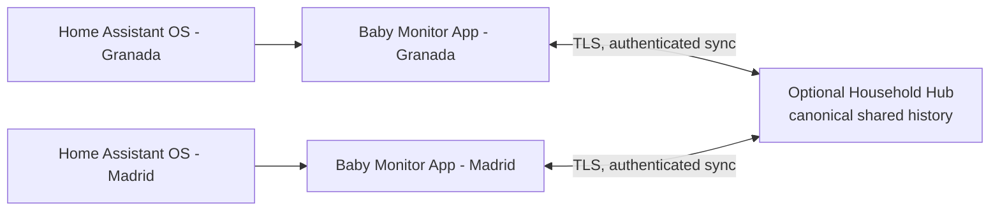

# Multi-home shared history

## Product decision

Every home gets the same normal Home Assistant experience:

1. Add the public Baby Monitor repository.
2. Install the **Baby Monitor** App from **Settings > Apps > App store**.
3. Start it and optionally enable **Show in sidebar**.
4. Configure that home's camera, cry source, lights, notifications, and AI
   provider from the App's Settings screen.

There is no custom `Esteban` dashboard, special entity registration, or private
installation path. A baby display name is profile data and does not change how
the App is installed or presented by Home Assistant.

## Why SQLite is not shared between houses

Each Home Assistant OS App has a private `/data` directory managed by
Supervisor. SQLite is the local source of truth for that installation and must
not be mounted into two running Apps or placed on an internet file share.
Doing so risks lock failures, corruption, partial image writes, and an outage in
one house when the connection to the other is unavailable.

The portable single-writer setup remains supported: one computer may reuse the
same `/data` directory while moving between homes, provided only one Baby
Monitor process is running. That is a migration mode, not concurrent sync.

## Target architecture

Concurrent sharing is an optional local-first feature built around a Household
Hub. It does not change the Home Assistant installation or sidebar experience.

Each App continues capturing and serving its local history when the Hub or the
other house is offline. A durable outbox retries later. The Hub provides the
combined household timeline; it is not a remote SQLite filesystem.

### Data contract

- Every installation has a stable `installation_id` and Location ID.
- Events use globally unique IDs and carry `created_at`, `updated_at`, origin,
  location, and schema version.
- Images are immutable objects addressed by SHA-256, allowing integrity checks
  and deduplication without changing frame IDs.
- Upload and download operations are idempotent, so interrupted sync can retry
  safely.
- Edits use explicit revisions; deletion, if added later, uses auditable
  tombstones instead of silently removing another home's record.
- The local database is never replaced wholesale during normal sync.

### Privacy and retention

Shared history is disabled by default. Joining a household requires a Hub URL
and household credential entered in Settings. Transport must use TLS, secrets
remain encrypted at rest, and the Hub must not be publicly browseable.

Metadata and image sync are separate consent choices for public users. For a
household that enables **Sync images** with Retention set to **Forever**, every
original image is uploaded, checksum-verified, and retained; synchronization
must never invoke local retention or delete a source image after upload.

## Delivery sequence

1. Add a non-destructive archive export/import with a manifest and SHA-256
   verification. This provides a safe migration from the current shared
   Madrid/Granada directory into Home Assistant OS.
2. Add the authenticated Household Hub API and immutable image object store.
3. Add each App's durable outbox, incremental pull cursor, and Settings UI.
4. Test two clean Home Assistant OS installations exactly through App store and
   Ingress, including offline capture, retry, duplicate delivery, and full
   image preservation.

Until these steps ship, location tags are ready for a future merge, but two
running Home Assistant OS Apps do not yet present one combined live history.
