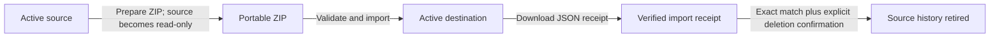

# Moving one history between homes

## Product decision

Every home gets the same public Home Assistant experience: install **Baby
Monitor** from the App store, optionally enable **Show in sidebar**, and select
that home's own camera, cry source, lights, notifications, and AI provider.

History can follow the family between homes, but only one installation writes
to it at a time. The supported workflow is an explicit, verified handoff. It
does not share a live SQLite file and does not attempt continuous cloud sync.

## Handoff flow



1. **Export at the source.** The App stops background writers, creates a
   point-in-time SQLite backup, verifies every referenced image, creates the
   ZIP, and leaves the source read-only.
2. **Import at the destination.** The entire archive is staged privately. The
   App validates paths, schema, record counts, database integrity, image sizes,
   and SHA-256 hashes before atomically replacing destination history.
3. **Verify the destination.** Review counts and images, then download the JSON
   import receipt generated by that installation.
4. **Retire the source.** Upload the receipt at the source and explicitly
   confirm deletion. Dataset ID, generation, manifest hash, and counts must all
   match the pending ZIP. Only history and images are removed; source Settings
   and encrypted credentials remain.
5. **Move back later.** Export the newer history from the active house and
   import it into the retired installation. A successful import makes that
   installation active again.

Before step 4, **Cancel transfer** is always available at the source. It removes
the temporary export ZIP and resumes local writes without deleting history.

## Portable archive format

The export is a standard ZIP designed for both lossless App migration and
analysis in other tools:

```text
README.txt
manifest.json
internal/history.sqlite3
data/frames.csv
data/sleep_events.csv
data/cry_events.csv
images/<location>/<year>/<month>/<day>/<frame-id>.<extension>
```

CSV files use UTF-8, a header row, comma separators, and one row per database
record. `frames.csv` includes `archive_image_path`, allowing tools to join each
record to its original image without understanding Baby Monitor's database.

`manifest.json` contains the archive generation, location list, record counts,
database hash, and an entry with size and SHA-256 for every image. The internal
SQLite snapshot is retained because CSV is intentionally an analysis format,
not a lossless representation of all database types and constraints.

The archive never includes `settings.json`, encrypted secrets, the encryption
key, Home Assistant access tokens, AI API keys, or private camera URLs. It does
contain private camera images and family history and must be stored accordingly.

## Safety properties

- Preparing an export makes the source read-only, preventing source and
  destination from silently diverging.
- Import is staged and validated before destination history changes.
- Re-importing the same archive is idempotent.
- Existing destination history requires an explicit replacement confirmation.
- A corrupt or incomplete database or image leaves destination history intact.
- Source deletion requires a receipt matching the exact pending archive plus a
  separate destructive confirmation.
- House-specific Settings and credentials are never transferred or deleted.
- A retired source rejects new history writes until it imports a newer ZIP.

The receipt is an operational deletion guard, not a remote identity or digital
signature. Access to the App remains administrator-only, and administrators
must still keep the ZIP and receipt private.

## Disk usage during a move

Preparing an export temporarily keeps both the original history and its ZIP.
Import needs space for the uploaded ZIP, extracted validation copy, new history,
and rollback copy. Both endpoints check available disk before proceeding, but a
Home Assistant backup should still be taken before a large transfer.

After a matching receipt retires the source, its pending ZIP and old database
and image tree are removed. No automatic retention or image deletion occurs
before that final confirmation.
